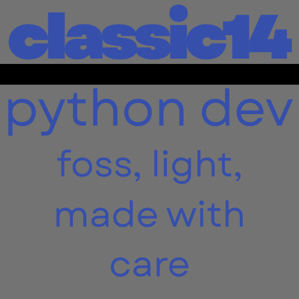

# welcome to hub! 
a very simple "demo" program.
its a basic "to-do" list and is FOSS.
it was made in python by classic14 (me :3).
and it used my own module: CASIC - (https://github.com/classiccatlinux-sudo/CASIC)

# how to use
while this basic program has no .exe .sh or .anything it does have
a raw python file. simply install python 3.x.x and go into your OS-es
CLI. then when your in the same folder as "hub.py" run it like this:
python3 hub.py and BAM your done! :3
 
# classic14
